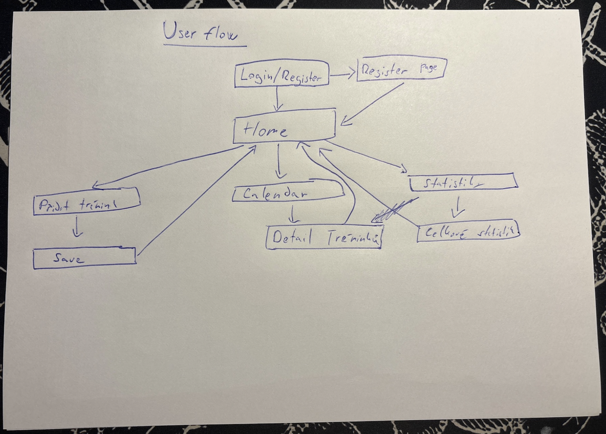
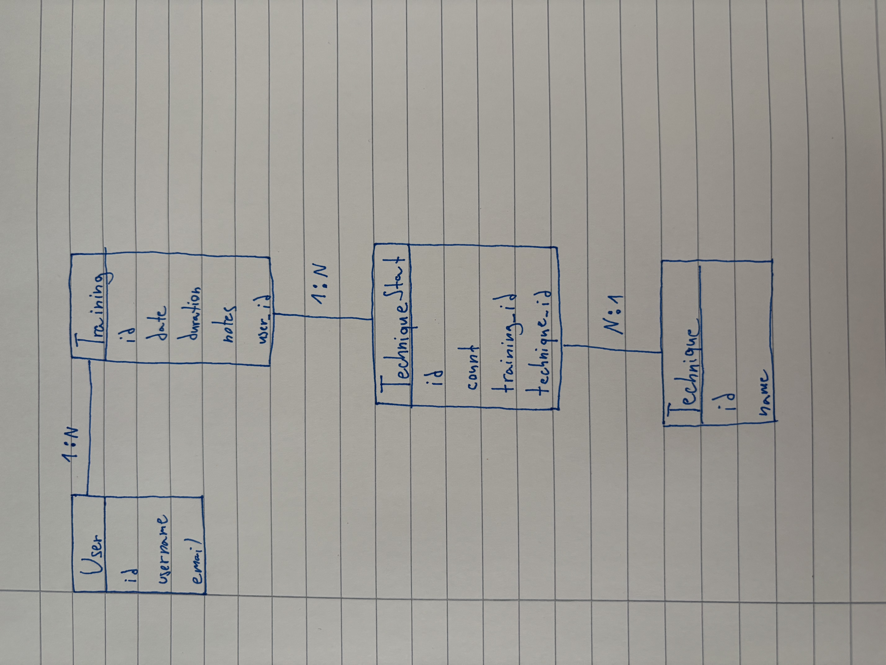

# FightLog
## MMA & BJJ Training Tracker

---

## O projektu

FightLog je webová aplikace určená pro zápasníky MMA a brazilského jiu-jitsu, kteří chtějí systematicky sledovat svůj trénink a dlouhodobý progres. V bojových sportech je důležité analyzovat průběh <u>tréninků</u>, výsledky <u>sparringů</u> a úspěšnost jednotlivých <u>submisí</u>. Tyto informace umožňují zápasníkovi lépe pochopit vlastní styl boje a identifikovat silné i slabé stránky.

Cílem aplikace FightLog je vytvořit přehledný digitální <u>tréninkový deník</u>, který umožní zaznamenávat všechny důležité informace o trénincích, technikách a výsledcích.

---

## Evidence tréninků

Registrovaný uživatel může do systému zapisovat jednotlivé <u>tréninky</u>. Každý záznam obsahuje základní informace, jako je <u>datum</u>, <u>čas trvání</u> a případné <u>poznámky</u>. Součástí záznamu mohou být také výsledky <u>sparringů</u>, například <u>výhry</u>, <u>prohry</u> nebo <u>remízy</u>.

Zápasník si zároveň může zaznamenat konkrétní <u>techniky</u> nebo <u>submise</u>, které během sparringu použil nebo naopak inkasoval. Mezi typické grapplingové techniky patří například <u>armbar</u>, <u>triangle choke</u>, <u>rear naked choke</u>, <u>kimura</u> nebo <u>guillotine</u>. Díky tomu lze sledovat, které techniky jsou pro daného zápasníka nejúspěšnější a na kterých je potřeba více pracovat.

---

## Statistiky a analýza výkonu

Po přihlášení do aplikace se uživateli zobrazí hlavní přehled obsahující statistický graf všech použitých <u>technik</u>. Tento graf umožňuje rychle zjistit, jaké <u>submise</u> zápasník používá nejčastěji a jak se jeho styl boje postupně vyvíjí.

Další důležitou součástí aplikace je <u>kalendář tréninků</u>, ve kterém jsou vizuálně označeny všechny dny, kdy byl trénink zaznamenán. Uživatel se může kdykoliv vrátit k určitému dni a zobrazit detailní informace o průběhu tréninku.

---

## Role uživatelů

**<u>Anonymní návštěvník</u>**  
Má přístup pouze k úvodní stránce aplikace a pro další práci se musí <u>registrovat</u> nebo <u>přihlásit</u>.

**<u>Registrovaný uživatel</u>**  
Může zapisovat nové <u>tréninky</u>, upravovat své záznamy a sledovat osobní <u>statistiky</u>.

**<u>Administrátor</u>**  
Má oprávnění spravovat databázi aplikace a kontrolovat obsah systému.

---

# Analýza a design aplikace

## User Flow

Diagram zobrazuje základní navigaci aplikace z pohledu uživatele.

---

## Wireframes

Návrh rozložení jednotlivých mobilních obrazovek aplikace.

## E-R diagram / Databázové schéma

Databázový model aplikace **FightLog** je navržen pro evidenci tréninků, použitých technik a základních statistik uživatele. Hlavním cílem tohoto modelu je umožnit ukládání tréninkových dat tak, aby bylo možné zpětně sledovat průběh jednotlivých tréninků, vyhodnocovat používané techniky a zobrazovat přehledy a statistiky.

Základní entitou je **User**, která reprezentuje registrovaného uživatele aplikace. Každý uživatel si vede vlastní záznamy, proto může být navázán na více tréninků. Mezi entitami **User** a **Training** je tedy vztah **1:N**. Jeden uživatel může mít mnoho tréninků, ale každý konkrétní trénink patří právě jednomu uživateli.

Entita **Training** představuje jeden konkrétní tréninkový záznam. Obsahuje základní údaje, jako je datum, délka tréninku a případné poznámky. Tato entita slouží jako hlavní záznam tréninkové aktivity. V jednom tréninku může být zaznamenáno více různých technik nebo submisí, které byly během sparringu použity.

Samotné techniky jsou reprezentovány entitou **Technique**. Tato entita obsahuje seznam všech technik, které se v aplikaci sledují, například armbar, triangle choke, rear naked choke, kimura nebo guillotine. Jedna technika se může objevit ve více různých trénincích, protože stejnou techniku může uživatel použít opakovaně v různých dnech.

Protože mezi entitami **Training** a **Technique** vzniká vztah **M:N**, je tento vztah realizován pomocnou entitou **TechniqueStat**. Tato entita propojuje konkrétní trénink s konkrétní technikou a zároveň ukládá doplňující údaj, například počet použití dané techniky v rámci jednoho tréninku. Díky tomu lze sledovat, jak často byla konkrétní technika použita, a následně tato data využít pro statistiky a grafy.

Mezi entitami **Training** a **TechniqueStat** je vztah **1:N**, protože jeden trénink může obsahovat více záznamů o technikách. Stejně tak mezi entitami **Technique** a **TechniqueStat** je vztah **1:N**, protože jedna technika se může vyskytovat v mnoha různých trénincích.

Tento databázový model je přehledný, dobře rozšiřitelný a odpovídá zaměření aplikace FightLog jako tréninkového deníku pro MMA a BJJ.

---

## Entity

### User
- id
- username
- email

### Training
- id
- date
- duration
- notes
- user_id

### Technique
- id
- name

### TechniqueStat
- id
- count
- training_id
- technique_id

---

## Vztahy mezi entitami

- **User — Training** = **1:N**
- **Training — TechniqueStat** = **1:N**
- **Technique — TechniqueStat** = **1:N**

Z toho vyplývá, že mezi entitami **Training** a **Technique** existuje nepřímý vztah **M:N**, který je realizován pomocí entity **TechniqueStat**.

---

## Cíl projektu

Cílem projektu FightLog je vytvořit přehlednou databázovou webovou aplikaci pro evidenci tréninků bojových sportů. Aplikace umožní zápasníkům sledovat jejich progres, analyzovat statistiky technik a dlouhodobě zlepšovat výkon v MMA a grapplingu.
